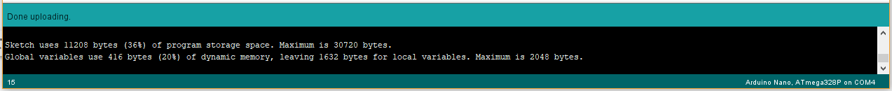
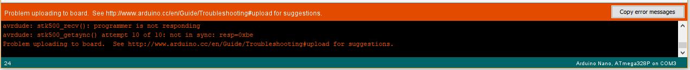

# Aquarius by Northern Circuits Inc
Repo for Aquarius Source Code.

Created by Stephen Co <stephen.co@northern-circuits.ca>, January 2018.

Please refer to the heavily commented sketch code for usage.  In general, user parameters are marked with *** USER SETTINGS *** in the code.  When changing electromagnet duty cycle, never increment more than 5.  Always edit, upload, test, and iterate!\

# Programming instructions

So here goes, this is an example of how to program the width of the visible water stream to be wider or narrower.

<ol>
<li>The source code file is called main.ino, download it and save it to a folder of your choice. </li>

<li>Next step is to download the Arduino IDE here https://www.arduino.cc/download_handler.php?f=/arduino-1.8.6-windows.exe .  This is a free software tool that will allow you to program the source code of Aquarius onto the PCB (after modifying the code).  After downloading it, simply double-click to install. </li>

<li>Once installed, launch it but make sure to update it with the FastLED library (it's a special library of code that allows the source code to interface with the LED lights).  You can do that by going to Sketch -> Include Library -> Manage Libraries as seen in the following screenshot: 

</img>
 </li>

<li>You should see a screen like the following after going through those menu options: 

</img>
 </li>

<li>In this window, you want to type "FastLED" and select the latest version and then press Install: 

</img>
 </li>

<li>Once installed, you can exit that window and go back to the main window.  You'll need to select the correct microcontroller and processor.  Refer to the following 2 screenshots: 

</img> 
AND 
</img>
 </li>

<li>Once you have selected the "Arduino Nano" and "ATmega328P (Old Bootloader)" options, you can then go to File -> Open and select the main.ino file that you previously downloaded from this email.  You should see something like this after opening it: 

</img>
 </li>

<li>Now look for this line here: 

</img>

The value in the source code I attached is '84' by default.  This controls the "strength" of the electromagnet.  The higher it is, the wider the stream will be.  The lower it is, the narrower the stream will be.  Before you adjust anything, plug the USB cable into Aquarius and the other end into your PC.  Your PC will basically be programming the Aquarius lamp (and you can change colors and more too!). </li>

<li>Now, what you want to do is start with a value of 84, test it out, and if its wide enough, stop.  You don't want to just jump to a value of say 120 without increasing it because you might accidentally hit a value that is too high causing the stream to shoot water outside of the funnel!  So as a start, try a value of 84, and go to Sketch -> Upload.  You should see it will first begin to compile the sketch in the bottom status bar as shown here: 

</img>
 
And then it will finish uploading as shown here: 

</img>
 </li>

<li>HOWEVER, you might also see something like this: 

</img>
 
DON'T WORRY!  In almost all cases, it probably means you have the wrong PORT selected (because you have more than one USB port I assume?).  What you can do is go to Tools -> Port and select a different port and try again.  You should see something like this: 

</img>
 </li>

<li>Once you finish uploading the code, you can try to test Aquarius out by turning it back on and seeing how wide the stream is.  Make sure to use the wall adapter when doing so as the USB cable does not supply enough current to power the lamp.  To save time walking back and forth and plugging it into a wall, you can plug both USB cable and wall plug into Aquarius (so you can test it out on the spot).  If its too wide, you can decrease the value in steps of 5 (so from '84' to '79') and continue trying it out until you find a value that meets your expectations. </li>

<li>Once you find a value that is suitable, you can stop and use the lamp as you would normally.  One thing to note though, is if your value has reached around 120, that might be too high and may cause the electromagnet to get too hot.  Let me know if you're hitting this value without seeing any change in the width.  The optimal value would be where the sound becomes a muddled splash rather than a loud splash.  And the water stream should be about 1 CM away from the left and right sides. </li>

<li>If you notice that the water stream is slightly tilted to one side, you can gently nudge/move the water spout away from that side with your finger.  The spout is very sensitive and may have moved either during transit/shipping, due to temperature changes in your environment, or even bumped by accident.  Moving the spout gently will not damage it and may be required if it has shifted over time.  Remember to move it gently as it is attached to a spring mechanism as well as SLA printed part which are fragile. </li>

#### Copyright (C) Northern Circuits Inc - All Rights Reserved
* Unauthorized distribution of any file listed in this repository, via any medium is strictly prohibited without written consent from the original author (stephen.co@northern-circuits.ca).
* Files may be modified or used directly for personal use only.
* At any point in time, the author may (at his discretion) release all files to the public domain without advance notice.
